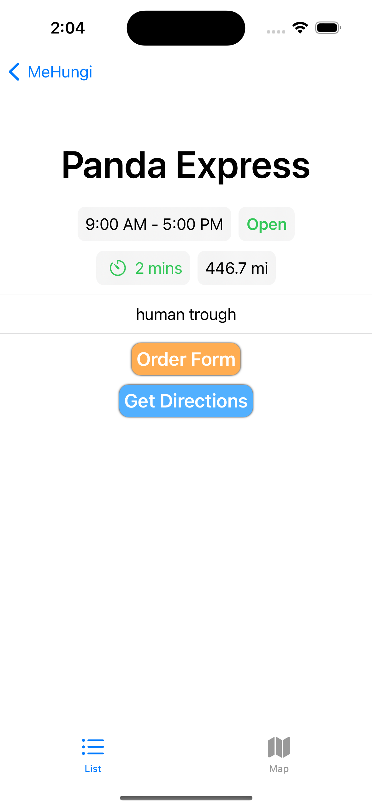

# Explanation Page:

## App Overview:
  

<h3>Restaurant Display Tab<h3>

This acts as the hub for the all of the restaurants at UCSD. It displays the restaurant name, expected wait time, and distance from user as a clickable button that stretches across the screen. 

On this page there is a search bar that will let you look for particular restaurant names eliminating the rest from the list. There is also a settings button that let's you choose the order you display each restaurant button. 

* Wait time is only looking at the same wait time that is displayed
* Distance is only looking at the same distance that is displayed 
* Convenience is ______________________

<h3>Restaurant Information Page/Popup<h3>

This pages displays more personalized info for the restaurant that has been selected. The relevant info includes the name, open hours, whether it's open, the wait time, and the distance from the user, as well as some description of the restaurant.

  

The "Order Form" Button redirects you to a form where you can place an order for that particular restaurant.

The "Get Directions" Button reditects the user to Apple Maps and plots a route from the user to the cooridnates of the restaurant.

<h3>Order Form<h3>

This page acts as a form for ordering. Whenever someone clicks on one of the buttons, it appends a string to an interal list of strings that is displayed as you click. When the order is sent, the list of strings is sent with a few other relevent values (order time, specific order UUID, number of orders already, and restaurant name) for the order as JSON key value pairs.

  

If someone clicks the send order button without actually adding any orders, this popup will appear.

  

If someone clicks the send order button when they have an order still active, this popup will appear.

  

 

<h3>Map Tab<h3>

 

<h3>Order Display Tab<h3>

 

## Server Overview:

  

<h3>Flask Endpoints<h3>

  

<h3>Data Generator<h3>

  

<h3>Machine Learning<h3>

  

## Terminal Overview: