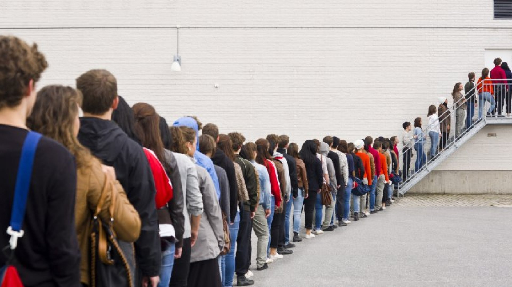
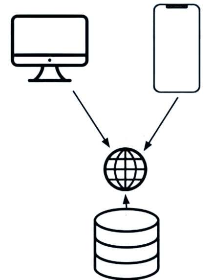

 <h1> <b> ECE 196 Project</h1> </b> 

 <h2> General Problem / Project Description </h2> 

 

In short, lines suck. Sometimes you just don't have enough time to spare and have to choose the quickest option regardless of personal preference. In the case of restaurants, often you won't know how long you will have to wait until you actually arrive. 

UCSD has attempted to remedy this by the implentation of Triton2Go, but practically any student who has used it can tell you the innacurracy of the service. We hope to present a solution that takes the frustration out of getting your meals.

 

 <h2> App-Server-Terminal Relationship </h2> 

 

To implement our solution, we need to create three different parts:
1. <b>App:</b> Displays the wait times of and map to different restaurants in the UCSD area. 
2. <b>Server:</b> Store restaurant info and calculate changing wait times as new data comes in.
3. <b>Psuedo-Cash Register:</b> Interface for ordering food and sending out total wait times for each order to the server. 

The App will have to request wait time and restaurant data from the server using RESTful API requests. The Register will have to modify data in the server by supplying wait times at specific times so the server can process and update the data.

 
 
 

 <h2> Video: </h2> 

 <video width="400" height="240" controls>
  <source src="video.mov" type="video/mp4">
</video> 

 
 

 <h2> Meet the Team! </h2> 

| Eric Shults | Aaron McCully |
| ----- | ----- |
|  |  |
| Backend and Hardware Development | Frontend Swift Development |