# Explanation Page:

<h2> App Overview: </h2>
 

<h3>Restaurant Display Tab</h3>

This acts as the hub for the all of the restaurants at UCSD. It displays the restaurant name, expected wait time, and distance from user as a clickable button that stretches across the screen. 

 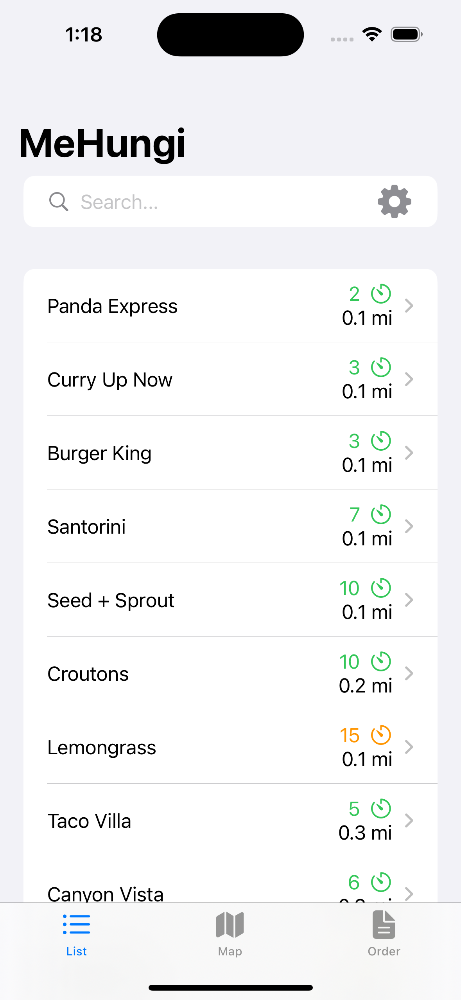 

On this page there is a search bar that will let you look for particular restaurant names, eliminating the rest from the list. There is also a settings button that let's you choose the order that the restaurants are displayed in. 

 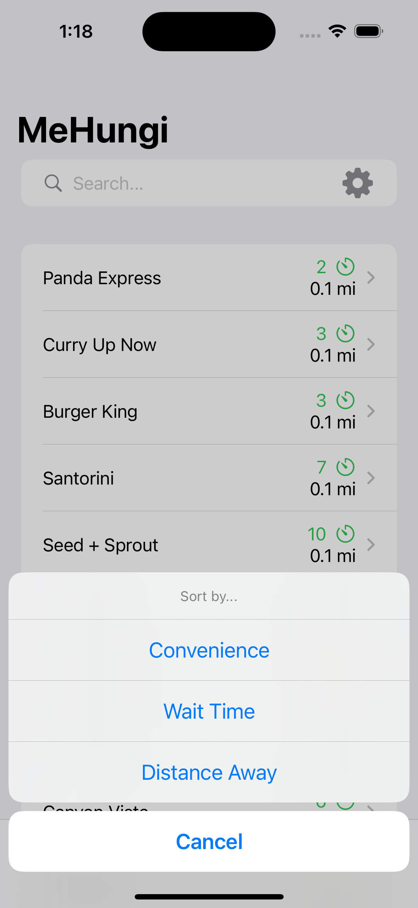 

There are a few ways that you can sort the restaurants by
* wait time
* distance away
* convenience...

Wait... What is convenience?
We spent considerable time trying to decide what convenience could look like as a predefined standard. We came up with a sorting method that utilizes both wait time and distance away.

Our approach:

 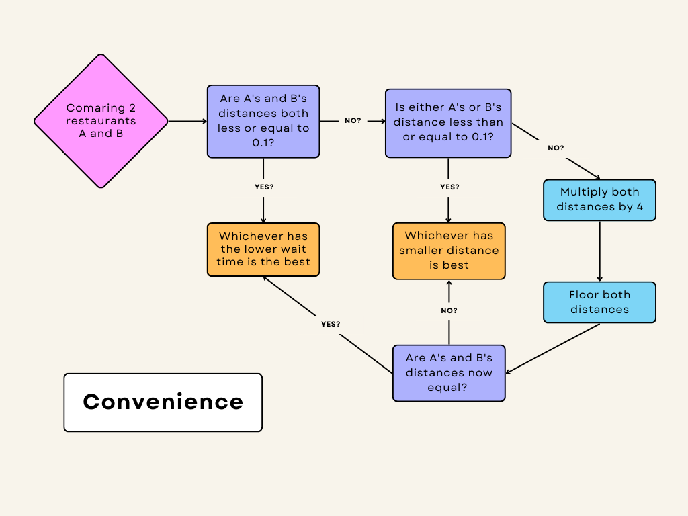 

For further clarification, when we say floor, we are referring to the function in mathematics. This takes any number and rounds it down. As an example, 1.67 would become 1.

 

<h3>Map Tab</h3>

A list is nice, but we thought it was important for users to be able to see these locations from a maps perspective as well. This tab displays the user's location as well as the location of restaurants at UCSD. This tab also contains a search bar, which restricts which restaurants the user will see on the map view.

 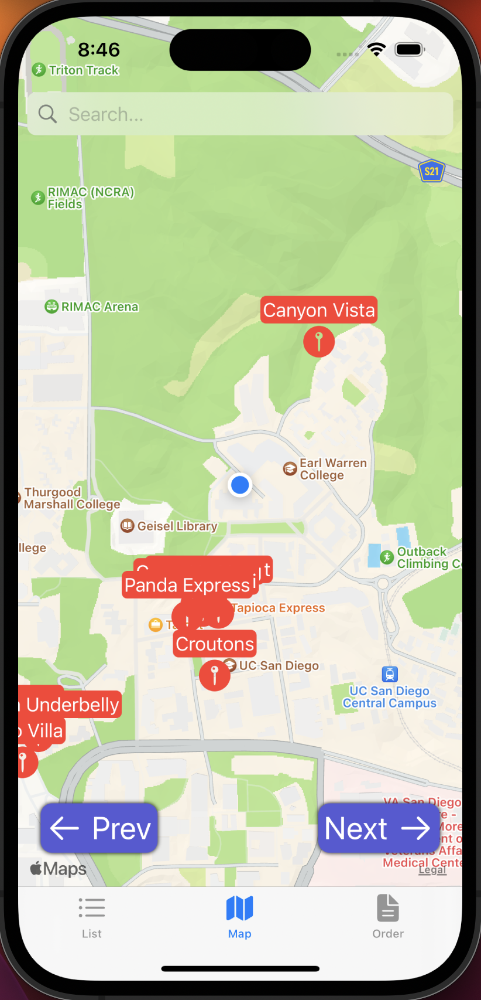 

The map view can be somewhat overwhelming though, and with so many options, the user might want to go straight to the ideal locations. The next and previous buttons on the bottom of the tab allow for the user to navigate between the restaurants by convenience, as defined earlier. Futhermore, the buttons will only take the user to locations which match the search bar restrictions.

 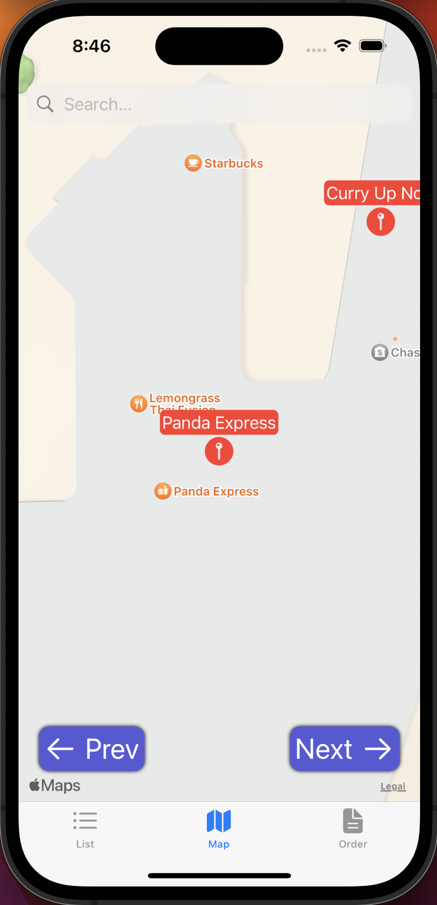 

Clicking on the restaurant's red icon will bring up the restaurant's information page.

 

<h3>Restaurant Information Page/Popup</h3>

This pages displays more personalized info for the restaurant that has been selected. The relevant info includes the name, open hours, whether it's open, the wait time, and the distance from the user, as well as some description of the restaurant.

 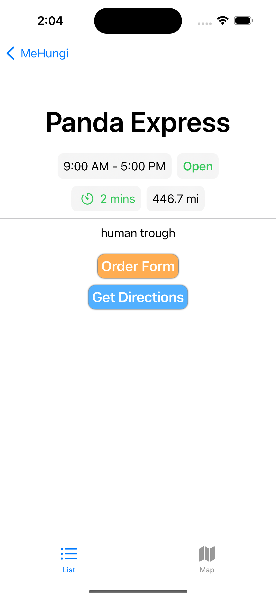 

The "Order Form" Button redirects you to a form where you can place an order for that particular restaurant.

The "Get Directions" Button reditects the user to Apple Maps and plots a route from the user to the cooridnates of the restaurant.

<h3>Order Form</h3>

This page acts as a form for ordering. Whenever someone clicks on one of the buttons, it appends a string to an interal list of strings that is displayed as you click. When the order is sent, the list of strings is sent with a few other relevent values (order time, specific order UUID, number of orders already, and restaurant name) for the order as JSON key value pairs.

 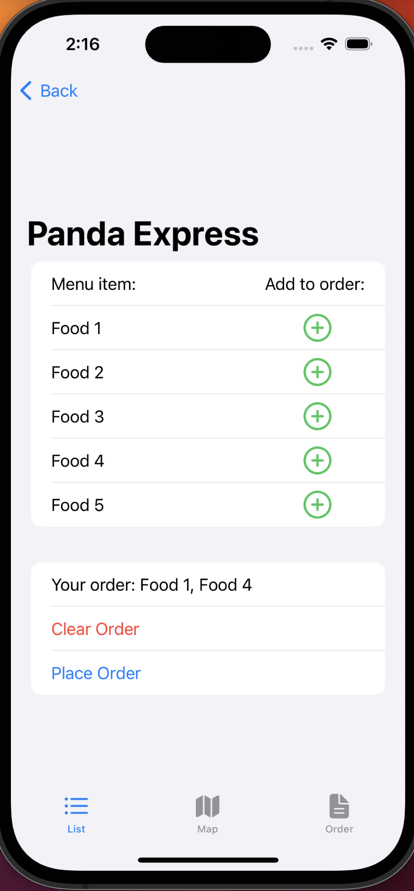 

Special cases:
* no items in order
* an order has already been placed
* the location is closed

If someone clicks the send order button without actually adding any orders, this popup will appear.

 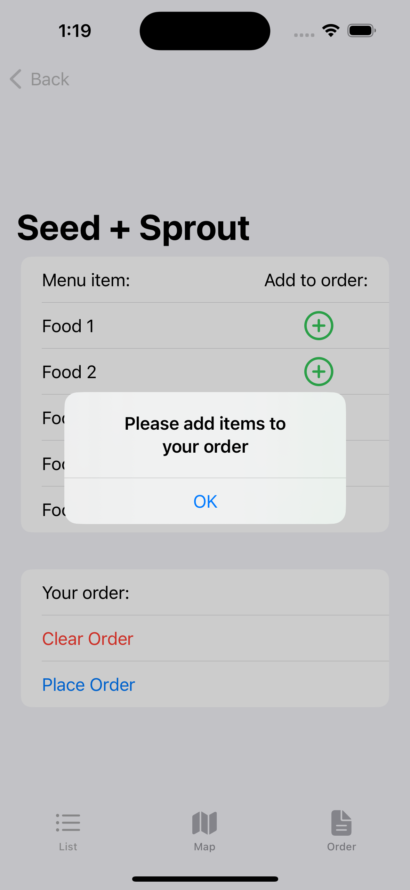 

If someone clicks the send order button when they have an order still active, this popup will appear.

  

Lastly someone clicks the send order button when the location they are trying to order from is closed, this popup will appear.

 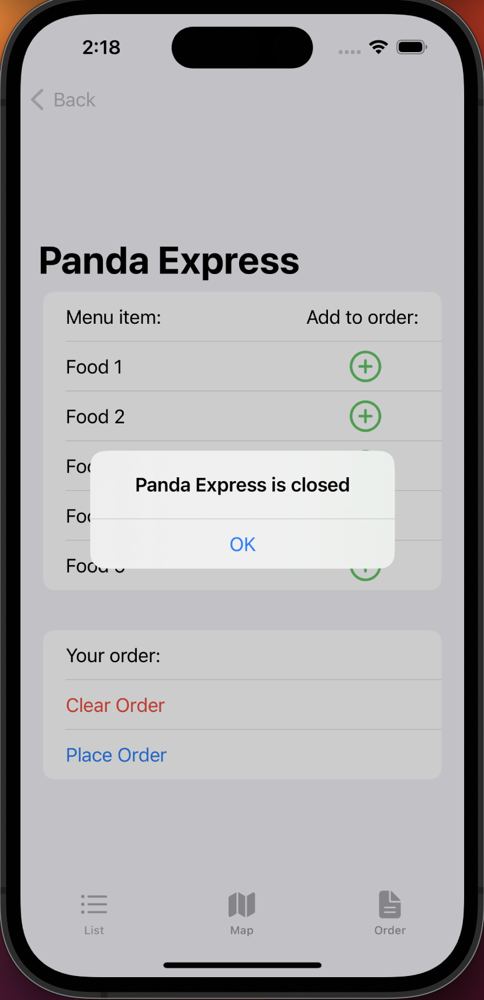 

 

<h3>Order Display Tab</h3>

The order tab is the third and final tab that the user can access. If the user has yet to order anything, and decides to go to the order tab, this page will be shown.

 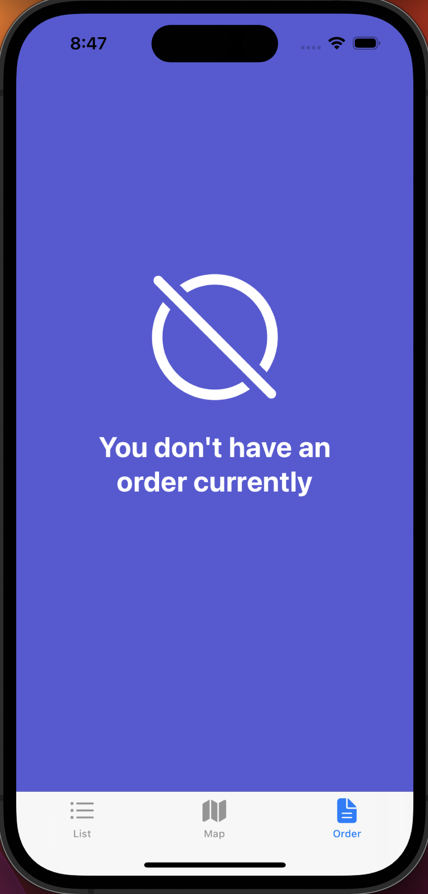 

This tab becomes useful once a user has placed their order through the order form screen shown earlier. Once that has been done, the order tab will display relevant information, including the estimated finish/pickup time, the name of the restaurant, and the items you ordered

 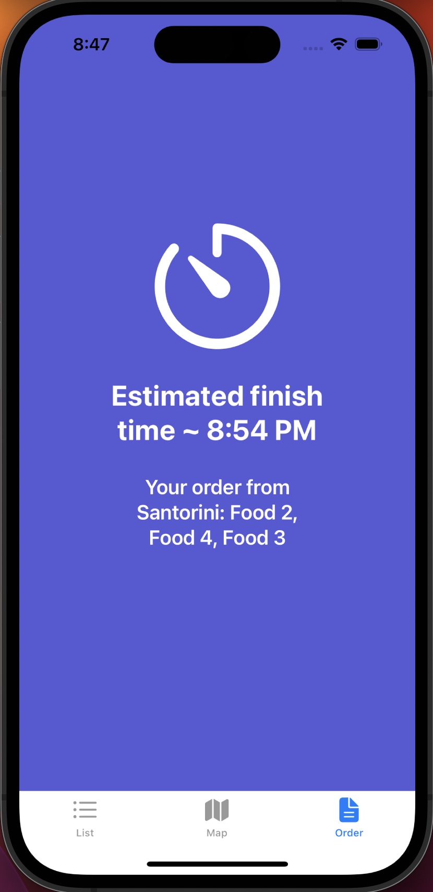 

Once the restaurant has completed your order, the order tab will update itself to notify you of its completion. This screen also includes the same "Get Direction" button as the restaurant information view.

  

 

<h2> Server Overview: </h2>

  

<h3>Server Uses:</h3>

 
We thought it best that our app did not contain all of the restaurant info because you would need to update the app every time anything about one of the restaurants changed. Also, with the machine learning aspects of this project, it would be best for the large amounts of data processed to not be stored on a person's iPhone due to storage and performance issues. Also, if we added any features where an outside source, like a restaurant, tried to input data, it would have to talk to establish a connection with every phone instead of keeping all the data in one place.

 
We decided that when the app boots up or refreshes, it will request information about UCSD restaurants in two stages. First, it will request all of the unique UUIDs for each restaurant and then use those UUIDs to ask for specific restaurant JSON files one after another. This made it much easier to debug and see if the restaurants had valid info. If we just requested all of the restaurants at once, the app would still be able to do it, but each pages would be much larger and harder to read from our end. 

  

<h3>Flask Endpoints</h3>

  
When creating a web server for an app to request info from, you need to make sure that you design it so that it is limited in the things that it can ask for and send. To create these limits, we had to set up endpoints that each contain the necesary get, put, post, and delete requests built in. 

 
Since we used Python, the Flask library was used to create the endpoints and define the API requests possible. Below is the general structure of a Flask app and the endpoints:

 

 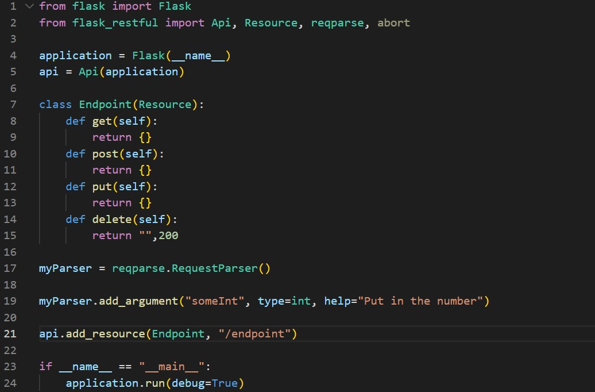 

As you can see, this is very bareboned but this is what a very basic server with almost no functionality would looklike. We create a class with methods that are the RESTful API request names. Based on what you want your server to do, you'll modify the body of these methods, their arguments, etc. so that they best fit you client.

Here is a snippet of what one of our endpoints looks like, too:

 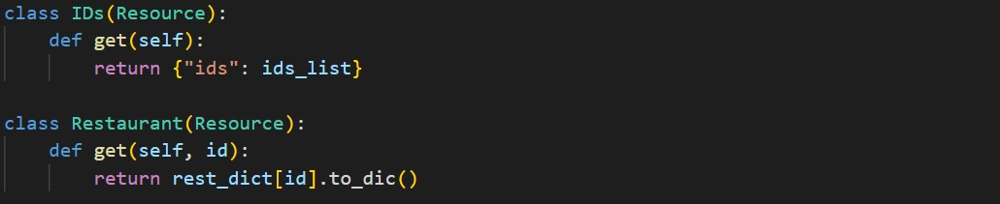 

 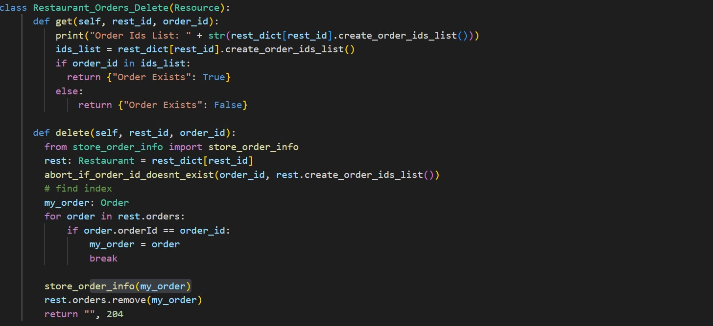 

 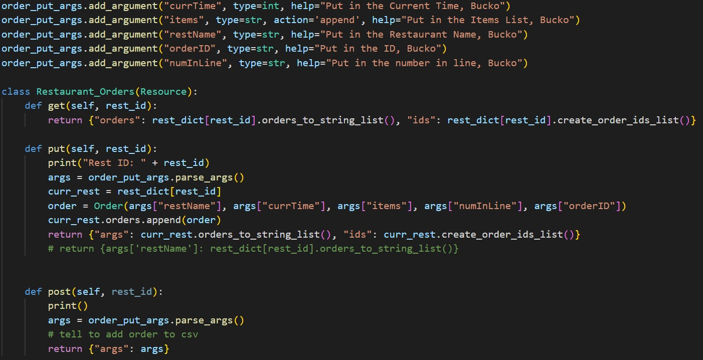 

 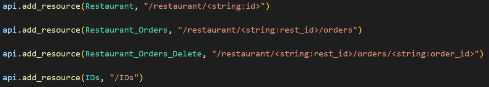 

  

The bareboned example was just one resource and endpoint, but we don't want to request all the info at once as that's more costly/will be slower, and we don't need to spend the time and space parsing the info in the app when we don't need it at that time. Instead we split our server so that it would have a few different endpoints that would serve different api requests for specific parts of the app. If we need restaurant info, we do an get request at the /restaurant endpoint as defined in this file's internal Restaurant class, if we wanted order info, we would request from the orders endpoint, etc.

<h3>Data Generator</h3>

  

We were unable to find large datasets of wait time info to train a machine learning algorithm on services like Kaggle and these would likely be inaccurate for a university anyway. We personally did not have the resources to probe for accurate wait times as you would need to either get that information directly from the companies (which they might not even have been collecting) or surveyed ourselves, in which case would not have provided nearly enough info to train a machine learning algorithm. 

Instead, we decided to create large amounts of starting data so the machine learning algroithm could learn from something initially while we actually collected information from users through the app/terminal. To at least approximate real life, a few variables were created that would be modified depending on the restaurant, time of day, day of the week, and number of orders in line currently. These variables were then input into a python method that randomly generated a number with probabilities matching a gaussian distribution. This method took in desired mean and desired standard deviation of the gaussian. I wanted a guassian instead of straight random function because it's unlikely that the wait time will every go above a certain point for each restaurant. This way, though not perfect better simulates real wait times.

Essentially, there is a function that takes in a restaurant as an argument, randomly generates the time of day, day of the week, and number of orders. It does some number crunching and with all of those randomly generated variables + the argument, returns a list with all of those values in a specific order. We then create a data frame (essentially a python excel sheet) using the pandas library and run a for loop with that function that creates a list and iterate tens of thousands of times. When the datafram is populated with a sufficent number of rows of data, we export it as a csv file so the machine learning can later use it without having to call this very slow function.

  

 

<h3>Machine Learning</h3>

  

To understand this, you need to understand the basics of decision trees. A decision tree is essentially like a binary search tree where instead of searching for specific elements inside of them, you are being asked true/false questions as you traverse down the tree and whatever the leaf of the tree is, will be the output of your question. It is sort of like a flowchart for computers. Here's a simple example:

 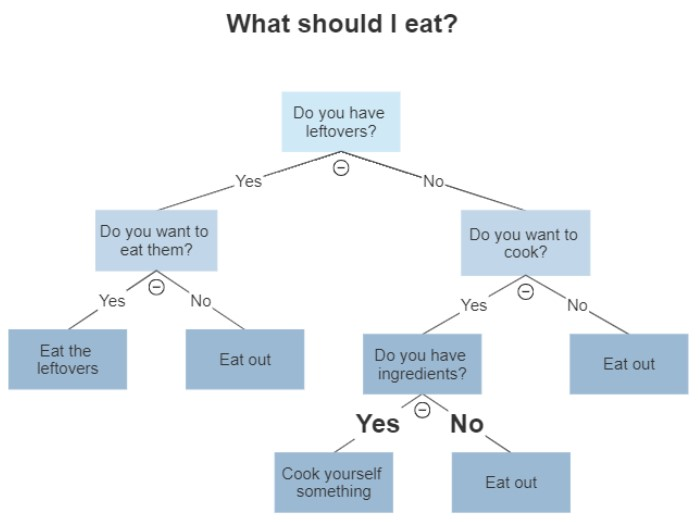 

Since we specicifically have some numeric inputs and want a numeric output, we won't use a decision tree but a regression tree. Regression trees deal with the value of something (i.e. numeric outputs) and classification trees deal more with saying what something might be (often string or boolean).

We wanted our machine learning algorithm to be fairly accurate, and usually the best way of doing that is by making your software learn slowly. Making several regression trees in a row will make things more accurate, but naturally machine learning will often make assumptions that don't end up being accurate and thus just appending trees means a good tree predictionhas the same weight as a bad one. The Gradient Boosting algorithm is one algroithm that slowly learns by creating trees of different weights based on their accuracy. The algorithm will continually make more and more trees with varying weights until a set max number of trees is met or our error stops being significantly reduced. The actual Gradient Boosting Algorithm is more complicated and this is a fairly simplified version. 

  

(This is not an image i made, I found it <a href="https://medium.com/analytics-vidhya/what-is-gradient-boosting-how-is-it-different-from-ada-boost-2d5ff5767cb2">here</a>) 

 

In our implementation, we import several methods and classes from the scikit learn python library (GradientBoostingRegressor, TrainTestSplit, R2_Score, MeanSquaredError, and GridSearchCV). We also once again use the pandas library to use dataframes as our inputs to the GradientBoostingRegressor. We start by reading from the CSV file we created in the previous section, then splitting the inputs and outputs into two separate variables. We then use both KFold and cross val score functions and iterated through different potential heights of decision trees and compare the results of the error. Whichever has the best score, will become our selected height for our model when the GradientBoostingRegressor is generating the random tree forrest. There is a way to optomize further by using grid search and having it return the configuration that will optimize our tree the most. The issue with this is that you have to manually input all the possible variations and that the function is O(n^2) so with 10000+ entries, it would take an incredibly long time to finish. Instead we just mannually tried a bunch of values and checked the error ourselves before setting the GBR paramaters.
 
Next we split the input and output data into training and test data. As it sounds, training data is what the GBR model learns from and test data is what we use to check if it's a good fit. This split is done randomly and is 20-80 as we've chosen. We then contruct a GradientBoostingRegressor object with member variables n_estimators=3500, learning_rate=0.05, max_depth=4, num_iter_w/out_change=25. We then input the training input and output data into the fit method on our GBR object. Now whevener we want to, we can input the same types of variables into a predict method of our GBR and it will give us the predicted output you would expect through the machine learning. Instead of recalculating this after every API request (would be very slow), we chose to keep this model within scope as long as the server is running. 

Once the first API request for a restaurant is given, the GBR will be created and stay withing the scope of the server's restaurant class where it can input what it needs to find the wait time which is needed in the API request. After the GBR is made, every subsequent API request asking for wait time will be much faster.

 

<h2> Terminal Overview: </h2>

The third part of our project is simulating the restaurants receiving and deleting orders once they're ready. This existence of this section of our project is in service of the ordering part of the app and server and thus didn't need to have a complex interface, it just needs to do a few variable API requests.

The way we formatted the terminal was for it to ask the user for which restaurant they wanted to access, if they gave a restaurant that matched the available restaurants in our collection, we would use the uuid of that restaurant to do a GET API request and receive all of the available orders at that specific restaurant.

 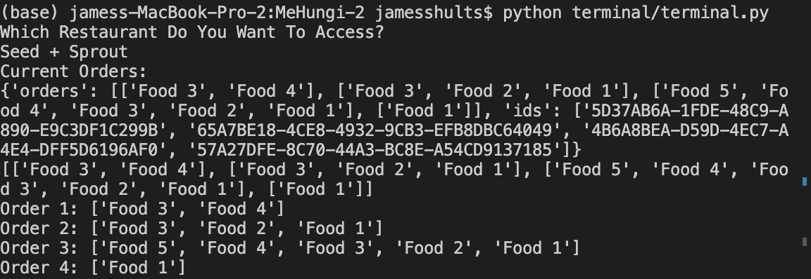 

 

Next, the terminal asks which order number we want to mark as complete. If you select a valid order, it will send a delete request to the server where it stores the deleted order information to use for machine learning and then removes the specific order from the member variable of the restaurant which is a list containing all of the orders. The terminal ends by saying it's been deleted and doing another get request to show the order is gone from the server.

 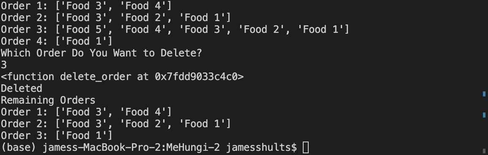 
