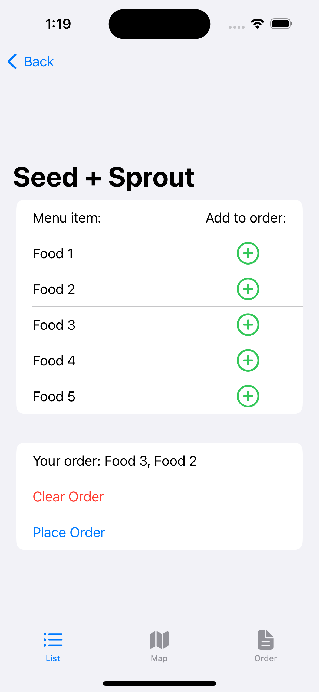

# Explanation Page:

## App Overview:
  

<h3>Restaurant Display Tab<h3>

This acts as the hub for the all of the restaurants at UCSD. It displays the restaurant name, expected wait time, and distance from user as a clickable button that stretches across the screen. 

On this page there is a search bar that will let you look for particular restaurant names, eliminating the rest from the list. There is also a settings button that let's you choose the order that the restaurants are displayed in. 

There are a few ways that you can sort the restaurants by
* wait time
* distance away
* convenience...

Wait... What is convenience?
We spent considerable time trying to decide what convenience could look like as a predefined standard. We came up with a sorting method that utilizes both wait time and distance away.

Our approach:

  

For further clarification, when we say floor, we are referring to the function in mathematics. This takes any number and rounds it down. As an example, 1.67 would become 1.

 

<h3>Restaurant Information Page/Popup<h3>

This pages displays more personalized info for the restaurant that has been selected. The relevant info includes the name, open hours, whether it's open, the wait time, and the distance from the user, as well as some description of the restaurant.

  

The "Order Form" Button redirects you to a form where you can place an order for that particular restaurant.

The "Get Directions" Button reditects the user to Apple Maps and plots a route from the user to the cooridnates of the restaurant.

<h3>Order Form<h3>

This page acts as a form for ordering. Whenever someone clicks on one of the buttons, it appends a string to an interal list of strings that is displayed as you click. When the order is sent, the list of strings is sent with a few other relevent values (order time, specific order UUID, number of orders already, and restaurant name) for the order as JSON key value pairs.

  

If someone clicks the send order button without actually adding any orders, this popup will appear.

  

If someone clicks the send order button when they have an order still active, this popup will appear.

  

 

<h3>Map Tab<h3>

 

<h3>Order Display Tab<h3>

 

## Server Overview:

  

<h3>Server Uses:<h3>

 
We thought it best that our app did not contain all of the restaurant info because you would need to update the app every time anything about one of the restaurants changed. Also, with the machine learning aspects of this project, it would be best for the large amounts of data processed to not be stored on a person's iPhone due to storage and performance issues. Also, if we added any features where an outside source, like a restaurant, tried to input data, it would have to talk to establish a connection with every phone instead of keeping all the data in one place.

 
We decided that when the app boots up or refreshes, it will request information about UCSD restaurants in two stages. First, it will request all of the unique UUIDs for each restaurant and then use those UUIDs to ask for specific restaurant JSON files one after another. This made it much easier to debug and see if the restaurants had valid info. If we just requested all of the restaurants at once, the app would still be able to do it, but each pages would be much larger and harder to read from our end. 

  

<h3>Flask Endpoints<h3>

  
When creating a web server for an app to request info from, you need to make sure that you design it so that it is limited in the things that it can ask for and send. To create these limits, we had to set up endpoints that each contain the necesary get, put, post, and delete requests built in. 

 
Since we used Python, the Flask library was used to create the endpoints and define the API requests possible. Below is the general structure of a Flask app and the endpoints:

 

  

 
As you can see,

Here is a snippet of what one of our endpoints looks like, too:

  

<h3>Data Generator<h3>

  

We were unable to find large datasets of wait time info to train a machine learning algorithm on services like Kaggle and these would likely be inaccurate for a university anyway. We personally did not have the resources to probe for accurate wait times as you would need to either get that information directly from the companies (which they might not even have been collecting) or surveyed ourselves, in which case would not have provided nearly enough info to train a machine learning algorithm. 

Instead, we decided to create large amounts of starting data so the machine learning algroithm could learn from something initially while we actually collected information from users through the app/terminal. To at least approximate real life, a few variables were created that would be modified depending on the restaurant, time of day, day of the week, and number of orders in line currently. These variables were then input into a python method that randomly generated a number with probabilities matching a gaussian distribution. This method took in desired mean and desired standard deviation of the gaussian. I wanted a guassian instead of straight random function because it's unlikely that the wait time will every go above a certain point for each restaurant. This way, though not perfect better simulates real wait times.

<h3>Machine Learning<h3>

  

## Terminal Overview:

The third part of our project is simulating the restaurants receiving and deleting orders once they're ready. This existence of this section of our project is in service of the ordering part of the app and server and thus didn't need to have a complex interface, it just needs to do a few variable API requests.

The way we formatted the terminal was for it to ask the user for which restaurant they wanted to access, if they gave a restaurant that matched the available restaurants in our collection, we would use the uuid of that restaurant to do a GET API request and receive all of the available orders at that specific restaurant.

  

 

Next, the terminal asks which order number we want to mark as complete. If you select a valid order, it will send a delete request to the server where it stores the deleted order information to use for machine learning and then removes the specific order from the member variable of the restaurant which is a list containing all of the orders. The terminal ends by saying it's been deleted and doing another get request to show the order is gone from the server.

  
