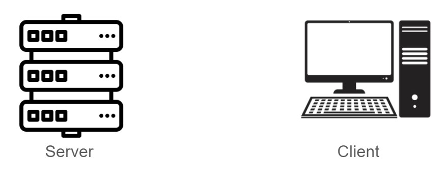

 <h1>Worskhop </h1> 

<h2> Intro: </h2>

This workshop acts as an overview to many of the introductory topics needed to understand modern server design. A focus will not be on the code, though there will be a demonstration portion using python.

 

<h3> Learning Objectives: </h3>

<ul>
    <li> 
        Understand the basics of what servers and clients are and how they interact with one another on an abstract level
    </li>
    <li>
        Understand the basics of JSON files
    </li>
    <li> 
        Understand endpoints and the 4 REST API requests types
       <ul> 
            <li>
                The why is more important than the actual implementation
            </li>
       </ul>
    </li>
    <li> 
        Be able to initialize a simple server using Flask
    </li>
    <li>
        Be able to set basic endpoints in the server
        <ul> 
            <li>
                If time, have all 4 request types included
            </li>
       </ul>
    </li>
    <li>
        Know how to send api requests to other websites
        <ul> 
            <li>
                Youtube, Twitter, etc.
            </li>
       </ul>
    </li>
</ul>
 

<h2> Learning Component:</h2>
 
The learning component will be lecture-style, going over various important prereqs you need to understand before the demo.

 
<h3>Servers and Clients:</h3>
 

Server:
<ul>
    <li>
        A database, or location where information is stored
        <ul>
            <li>
                Can be your own device or you can use a cloud computing service (AWS, Azure, etc.)
            </li>
        </ul>
        <li>
        Can be read from, added to, and modified, by clients according to the request type
        </li>
        <li>
        Server is a single location, and is consistent across all clients
        </li>
</ul>
Client:
<ul>
    <li>
        The user’s end (device)
    </li>
    <li>
        Can send an HTTP request to the server
    </li>
    <li>
        Types of request the user can make include: GET, POST, PUT, and DELETE
    </li>
    <li>
        We can expect multiple clients to make these requests at any time
    </li>
</ul>

  

<h3>JSON:</h3>
 

What is it?

<ul>
    <li>
        JavaScript Object Notation
    </li>
    <li>
        Type of file often sent over the internet for API requests
    </li>
    <li>
        Supports string, number, null, array, and object/dictionary data types
    </li>
</ul>

Why Use it?
<ul>
    <li>
        Relatively easy to read
    </li>
    <li>
        Many libraries already exist to parse/decode the files into objects
        <ul>
            <li>
                JSON is already valid JavaScript, Python, etc
            </li>
            <li>
                “Cross platform"
                <ul>
                    <li>
                        send data from one language and receive it in another language
                    </li>
                </ul>
            </li>
        </ul>
    </li>
    <li>
        Object transfer
        <ul>
            <li>
                Objects and classes can be defined differently in different languages so having a default way to send those objects as data is very useful
            </li>
            <li>
                Just sending a string or number is not super unique and useful, the “object” part of JavaScript Object Notation makes it special
            </li>
        </ul>
    </li>
</ul>

<h3>RESTful API:</h3>
 

Representational State Transfer (REST)
<ul>
    <li>
        Key of abstraction
        <ul>
            <li>
                Don’t want/need the users to know where this data is or how we got it, just that they can get it or change it using certain commands
            </li>
        </ul>
    </li>
    <li>
        Request Types (in JSON format):
        <ul>
            <li>
                GET ~ Client will receive information that is stored on the server
            </li>
            <li>
                POST ~ Client will add information to the server to be stored
            </li>
            <li>
                PUT ~ Client will update information that is already on the server
            </li>
            <li>
                DELETE ~ Client will delete information that is already on the server
            </li>
        </ul>
    </li>
    <li>
        Statelessness:
        <ul>
            <li>
                Requests are individual and do not rely on previous requests/information
            </li>
            <li>
                Each request contains all necessary information for a proper response by the server
            </li>
        </ul>
    </li>
</ul>

The uniformity of REST makes it easy to implement these requests from practically any language. Because GET, POST, PUT, and DELETE requests should all behave a certain way, we don’t need to spend a long time on design as long as we know what data will be in the JSON as we retrieve or send it.

<h2> Demo: </h2>
 
At this point we would stop showing these pages and walk people through how to make API requests and endpoints using python and if time permits, show how to make API requests on non-local servers
Listen to Instructions as we walk around and make sure everything has been set up:
Open up VScode and create a file called application.py 
Copy this code exactly and we can begin the demo:

 

  

 

For the full Workshop page, follow this <a href="https://docs.google.com/document/d/1b86Zt8crgq9gO3vszZwcIdX7_0InyT2TWyWKvfGUfuc/edit?usp=sharing"> link</a>.